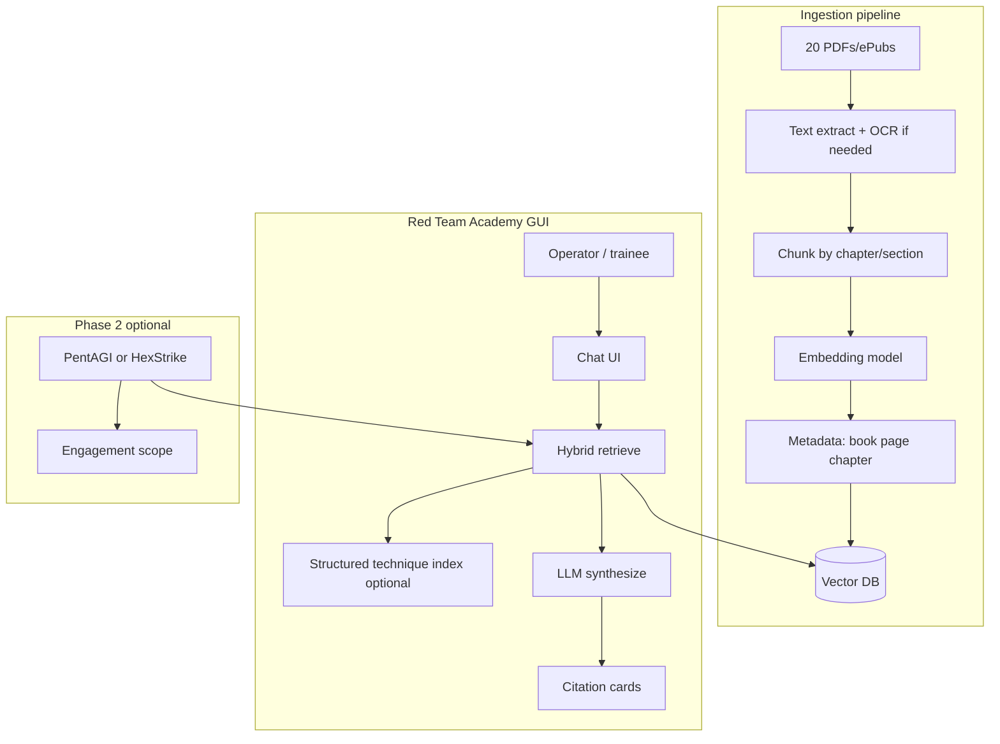

# Red Team Academy — Book RAG + Educational Agent (Planning)

**Goal:** Ingest ~20 hacking/pentest books into a private RAG corpus, expose them through a GUI chat agent for **professional education and authorized red team work**, without fighting public-model refusals. **Phase 2:** optional autonomous testing (PentAGI / Kali + MCP) grounded in the same knowledge.

**Status:** Planning only — books not yet ingested.

---

## Problem statement

Public chatbots (e.g. Grok) apply broad safety policies and often refuse or hedge on offensive security topics even when the use case is **legitimate** (training, certified pentesting, authorized engagements). That friction is unacceptable for a red team company training platform.

**Solution (two parts):**

1. **Ground answers in your licensed books** — cite chapter/page; model is instructed to prefer corpus over improvisation.
2. **Control the model and policy** — self-hosted or BYOK LLM with a **company system prompt** scoped to authorized security professionals (not “no restrictions”).

This is not about bypassing law; it is about **accurate, sourced professional education** on infrastructure you own.

---

## Recommended product shape

### Phase 1 — “Red Team Academy” (education first)

| Layer | Choice | Why |
|-------|--------|-----|
| **Corpus** | ~20 books + your future SOPs/ROE | Private company knowledge |
| **Retrieval** | Vector RAG (chunk + embed + search) | 20 books exceed [homeworkRag.js](../server/homeworkRag.js) style full-text dump (~80k chars) |
| **Chat UI** | New Hive web app or dedicated SPA | Similar to [ResearchWebApp.tsx](../../src/components/hive-apps/ResearchWebApp.tsx) |
| **LLM** | Local (Ollama/vLLM + Qwen/Llama) **or** Claude/Gemini with custom system prompt | Reduces refusal; local = air-gap option |
| **Auth** | Company login (Firebase / API keys) | Books stay private |

### Phase 2 — “Red Team Ops” (autonomous testing)

| Layer | Choice | Why |
|-------|--------|-----|
| **Orchestration** | [PentAGI](https://github.com/vxcontrol/pentagi) **or** Kali + [HexStrike](https://github.com/0x4m4/hexstrike-ai) | Proven tool execution |
| **Knowledge injection** | Same vector DB / API: `GET /rag/context?query=...` | Agent plans with your book methodology |
| **Gates** | Engagement scope file + human approve for exploit tier | Company liability |

**Do not merge Phase 1 and Phase 2 on day one.** Ship citation-backed Q&A first; add execution when corpus quality is verified.

---

## Architecture

### Hybrid retrieval (recommended)

1. **Vector search** — top-k chunks across all books for the user question.
2. **Keyword boost** — CVE, MITRE ID, tool names (`nmap`, `BloodHound`, `Kerberoasting`).
3. **Structured playbooks** (optional, Diagnose-style) — fast paths for “how do I test X?” checklists.
4. **Synthesis rules** — answer must cite `[Book Title, p. XX]`; say “not in corpus” if missing.

---

## Book ingestion pipeline (when you provide files)

### Input formats

| Format | Handling |
|--------|----------|
| PDF (text) | `pdftotext` / existing [intelDocuments.js](../server/intelDocuments.js) extractors |
| PDF (scan) | OCR (Tesseract or cloud OCR once per book) |
| ePub | epub.js / pandoc → plain text |
| DJVU | Convert to PDF first |

### Chunking strategy

- **Primary split:** chapter → section → ~500–800 token chunks with 10–15% overlap.
- **Metadata per chunk:** `bookId`, `title`, `authors`, `edition`, `chapter`, `section`, `pageStart`, `pageEnd`, `topics[]` (manual or LLM-assisted tagging once).
- **Do not** ship raw books to clients or expose download of full text via API.

### Copyright / ops note

Books are for **internal company use** on your infrastructure. Keep originals private; RAG stores chunks + embeddings; logs cite snippets only. Consult counsel if you plan multi-tenant SaaS selling access to the same corpus.

### Scale estimate (~20 books)

| Assumption | Order of magnitude |
|------------|-------------------|
| ~400 pages/book | ~8,000 pages |
| ~500 words/page | ~4M words |
| Chunks | ~15k–40k chunks |
| Storage | Fits easily on one server + pgvector or Qdrant |

---

## LLM strategy (avoiding “Grok won’t answer”)

| Approach | Refusal friction | Best for |
|----------|------------------|----------|
| **Local Ollama/vLLM** (Qwen2.5, Llama 3, etc.) | Lowest | Air-gapped lab, full control |
| **Claude / Gemini + RAG + professional system prompt** | Low–medium when answers cite corpus | Fast to ship |
| **Grok / ChatGPT consumer** | High | Not recommended as primary |

### System prompt principles (company policy)

- User is an **authorized security professional**; training and **scoped** engagements only.
- **Prefer retrieved passages**; do not invent CVEs, commands, or legal advice.
- Distinguish **education** vs **live target execution** (execution requires Phase 2 + scope).
- Refuse only: clearly illegal activity, non-consensual surveillance, out-of-scope targets.

### Reuse in AiBhive

- Pattern: [intelResearchChat.js](../server/intelResearchChat.js) with a **different** `DEFAULT_SYSTEM` and RAG context injection (like homework chat).
- Existing homework RAG is per-user Firestore — academy corpus should be **org-wide** collection e.g. `redteam_corpus_chunks` + company `orgId`.

---

## GUI options (PentAGI-like vs custom)

| Option | Pros | Cons |
|--------|------|------|
| **A. Custom “Red Team Academy” in AiBhive** | One brand, Firebase auth, reuse Intel/Research UI patterns | We build vector RAG + UI |
| **B. Fork PentAGI UI only** | Mature agent UI | Books not native; heavy Docker |
| **C. Kali desktop + HexStrike + separate Academy web** | Best execution later | Two apps until integrated |
| **D. Open WebUI + external RAG** | Fast prototype | Less integrated with your company product |

**Recommendation:** **Option A** for Phase 1 (your company product, book citations, training modes). **Option C** for Phase 2 execution: Kali 2025.4 + `hexstrike-ai` or PentAGI workers calling your RAG API.

### Academy UI features (Phase 1)

- Chat with **source citations** (book, page, snippet expander).
- **Library browser** — list books, chapters (metadata only).
- **Study mode** — “quiz me on AD attacks from Book X.”
- **Technique lookup** — MITRE ID → relevant corpus chunks.
- **Company notes** — tips that do not replace books (Pros-style feedback loop later).

---

## Implementation phases (AiBhive path)

### Phase 1a — Corpus (1–2 weeks after books delivered)

- [ ] Ingest script: `scripts/redteam-ingest-books.mjs`
- [ ] Vector store: start with **pgvector** (if Postgres available) or **Qdrant** Docker
- [ ] Embedding: `text-embedding-3-small` or local `nomic-embed-text` via Ollama
- [ ] Evaluation set: 50 questions you care about + expected book citations

### Phase 1b — API + chat

- [ ] `server/redteamAcademyRag.js` — ingest, search, `buildContext(query)`
- [ ] `POST /api/redteam-academy/chat` — auth, RAG, stream reply + `sources[]`
- [ ] `src/pages/redteam-academy/` or Hive app — chat UI

### Phase 1c — Model routing

- [ ] Env: `REDTEAM_LLM_PROVIDER=ollama|claude|gemini`
- [ ] Ollama base URL for lab machine

### Phase 2 — Autonomous ops

- [ ] PentAGI or HexStrike on Kali VM
- [ ] Middleware: before each agent step, fetch RAG context for current subtask
- [ ] Engagement scope + audit log
- [ ] Human approval for exploit/active tools

---

## What we need from you before build

1. **Books** — PDF/ePub upload (secure channel); list with title/edition.
2. **Hosting** — AiBhive cloud vs Kali-only air-gapped vs both.
3. **LLM preference** — local GPU specs or API keys (Claude/Gemini).
4. **Branding** — company name for the Academy UI.
5. **Sample questions** — 10–20 you’d ask Grok today that it refuses (acceptance tests).

---

## Acceptance criteria (Phase 1 done)

- [ ] Ask any technique question → answer cites at least one book chunk when material exists.
- [ ] Answer says “not found in library” when corpus has no support (no hallucinated steps).
- [ ] No public-model-style refusal on standard pentest curriculum (AD, web, cloud, reporting).
- [ ] Company users only; books not leakable via API.
- [ ] Latency: &lt; 10s for typical Q&A on modest hardware (local LLM dependent).

---

## Relation to other plans

- **Kali-native agent** — execution plane; Academy feeds it methodology via RAG API.
- **iPhone field logger** — separate; can attach voice notes to engagements, not book Q&A.
- **HexStrike / PentAGI** — Phase 2 orchestration; not required to ship Phase 1 education.
